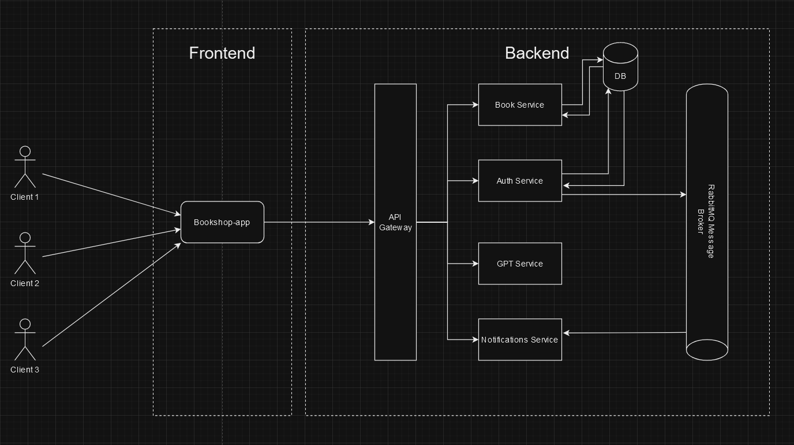

# Bookshop v2

The Bookshop is a web application dedicated to offering a wide range of books
to readers of all ages and interests. With a user-friendly interface and a vast collection of titles,
the bookstore aims to provide a convenient and enjoyable shopping experience for book lovers.

## Table of Contents

- [General Overview](#general-overview)
- [Features](#features)
- [Project Architecture](#project-architecture)
- [External Services](#external-services)
- [Technologies](#technologies)
- [Database Information](#database-information)
- [RabbitMQ Information](#rabbitmq-information)
- [Repository Modules](#repository-modules)
- [Getting Started](#getting-started)
- [API Endpoints](#api-endpoints)
- [Usage](#usage-examples)
- [Status](#status)
- [Contact Page](#contact-page)

## General Overview

Bookshop is a comprehensive online bookstore that offers a wide range of books catering to all interests.
With Bookshop, you can easily discover and purchase your favorite books, explore various genres, and stay updated with the latest releases.

## Features

- Responsive Design: Enjoy a seamless experience across devices, including desktops, tablets, and smartphones.
- Extensive Book Collection: Browse through a diverse selection of books, including fiction, non-fiction, bestsellers, classics, and more.
- Personalized messaging: The app leverages the power of LLM models to elevate the user experience, making app interactions more enjoyable than ever before.
- Search and Filter: Easily search for books by title, author.
- Book Details: Get detailed information about each book in system database.
- User Accounts: Create a personal account to manage your orders, save favorite books, and collect items in your shopping cart.
- Favorite list:  Create a wishlist of books you wish to buy or read, making it easy to track and manage your reading goals.
- Top 10 Books Recommendation: Discover popular books and trending titles with the Top 10 Books recommendation feature.
- Recently Added Books: Stay updated with the latest additions to the Bookshop collection, ensuring you never miss out on new releases.
- User Roles: The system supports three user roles: Admin, Employee, and User, each with specific privileges and access levels.
- Shopping Cart: Easily add items to your cart and manage quantities. Remove or modify items before completing your purchase.
- Order Placement: Proceed from the cart to place your order.
- Multi-Currency Support: Complete your orders in your preferred currency.
- Order Fulfillment: Admin and Employee roles can manage order fulfillment, ensuring smooth processing and delivery.
- Assigning Employees to Orders: Admin can assign specific orders to staff members for efficient order management.
- Book Addition: Admins and Employees can add new books to the system, expanding the collection with ease.
- Staff Management: Admin can add new Employees to the system.
- Order Assignment: Staff members can take ownership of assigned orders.
- And more.

## Project Architecture



## External Services
- OpenAI API
- React Leaflet
- Font Awesome

## Technologies

- Java 17
- Spring Framework 6
- Spring Boot 3
- Maven
- RabbitMQ
- PostgreSQL database
- Liquibase
- Docker & Docker Compose
- React.js
- Webpack
- Node Package Manager
- HTML
- CSS

## Database Information

The project uses the Liquibase library to manage the database.
Liquibase offers a user-friendly and secure approach to handling database creation,
management, and migration tasks. By maintaining the infrastructure as code, the project
benefits from various advantages, including the ability to monitor and
control any modifications made to the database structure. The database schema itself
has been implemented using the XML format, ensuring a structured and organized foundation
for data and structure management.

Database schemas and all database-dev related files can be found inside 'backend/services/db' directory.

Entity Relationship (ERD) Diagram


## RabbitMQ Information

The project leverages RabbitMQ, a powerful message broker, to efficiently handle 
various events within the application. RabbitMQ plays a pivotal role in creating personalized 
messages for users, such as generating welcome emails for newly registered users. 
This messaging system is designed to facilitate seamless communication between different 
components of application, ensuring a smooth flow of information.

### How RabbitMQ is utilized in project
The messaging system is employed to trigger specific actions based on events, enhancing the overall user experience. 
Some notable use cases include:

- User Registration:
Upon user registration, RabbitMQ is utilized to send personalized welcome emails, providing users with a warm introduction to platform.

- Custom Notifications:
RabbitMQ facilitates the creation and delivery of custom notifications, ensuring that users receive relevant and timely information tailored to their preferences and activities.

- Future Enhancements:
As project evolves, RabbitMQ will continue to be a central component for implementing additional features and functionalities, such as user-specific recommendations, activity alerts, and more.

## Repository Modules

```
.
├── .github       # CI/CD. Contains Github action workflow(s)
├── backend       # Backend part of bookshop
├── frontend      # Frontend part of bookshop
.
```

## Getting Started

### Requirements
- Git version control system
- Maven
- Node Package Manager
- Docker

### Start Guide

1. Go to 'backend/infrastructure/local' directory and make own copy of '.env.sample.' file. Save it as '.env' in same place.
2. Set up values for SPRING_SECURITY_SECRET, OPENAI_API_KEY and SPRING_MAIL_PASSWORD inside .env file.
3. Run ```mvn clean install -DskipTests``` command (this command will build and install docker images for all services).
4. Return to 'backend/infrastructure' folder and follow local environment start guide instructions.
5. Go to 'frontend/bookshop-app' folder and run ```npm install``` command (this command will install all necessary packages/libs for FE app)
6. Start frontend application in development mode by running ```npm start``` command.
7. Open [http://localhost:3000](http://localhost:3000) to view it in the browser.

## API Endpoints

### Swagger UI ref
- http://localhost:8081/webjars/swagger-ui/4.18.1/index.html

### Swagger Gateway Service

### Swagger Auth Service

### Swagger Book Service

### Swagger GPT Service

### Swagger Notifications Service


## Usage examples

### Start Page


### Contact page


### Login page


### Register page


### Register event personalized welcome email

#### Register operation

#### Register success with feedback message

#### Register event has been produced and sent to rabbitMQ queue

#### User registration event detected and consumed by Notifications Service

#### Personalized welcome message email has been sent to user


### User dashboard


### Book detail


### Admin dashboard


### Employee dashboard


## Status

_completed_

## Contact Page
Created by @mkrolczykk - feel free to contact me!
* E-mail: m.krolczyk66@gmail.com